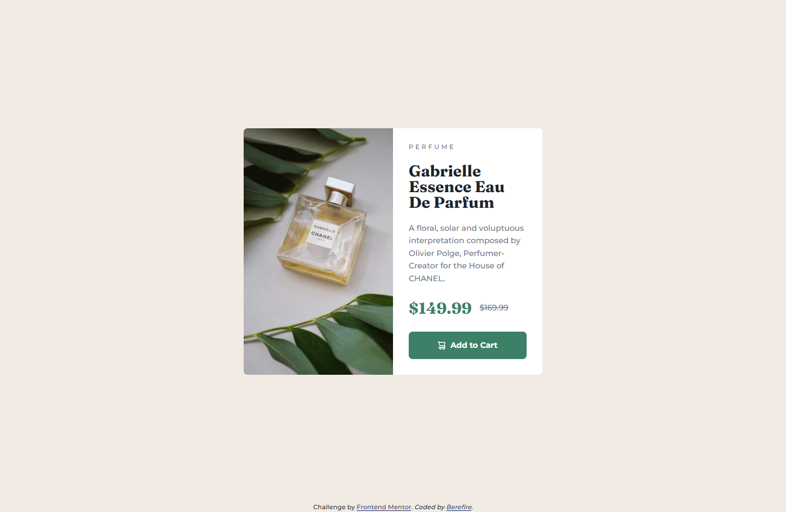
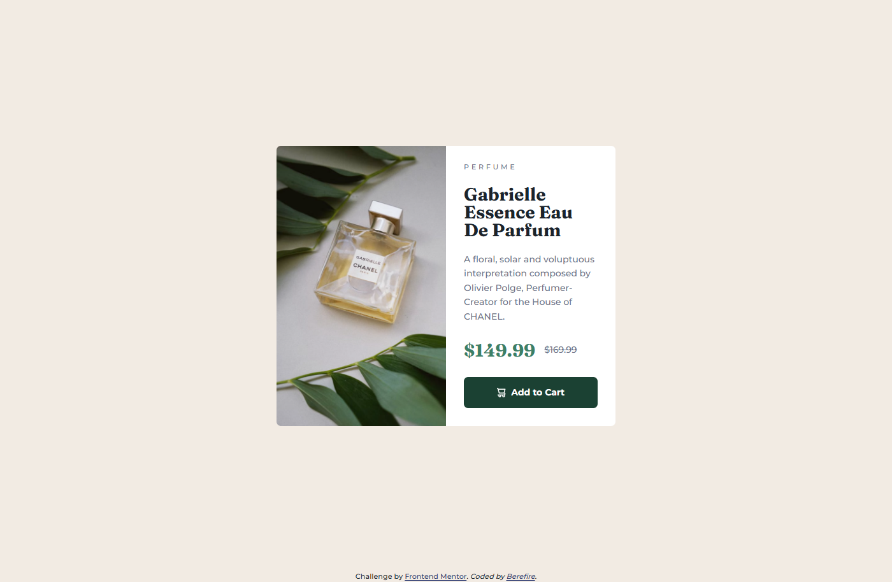
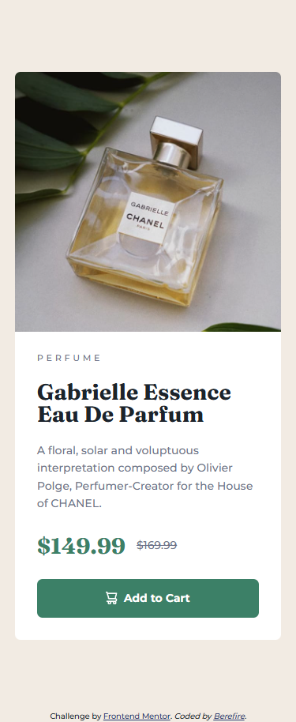

# Frontend Mentor - Product preview card component solution

This is a solution to the [Product preview card component challenge on Frontend Mentor](https://www.frontendmentor.io/challenges/product-preview-card-component-GO7UmttRfa). Frontend Mentor challenges help you improve your coding skills by building realistic projects.

## Table of contents

- [Overview](#overview)
  - [The challenge](#️the-challenge)
  - [Screenshot](#screenshot)
    - [Desktop](#desktop)
    - [Active states](#active-states)
    - [Mobile](#mobile)
  - [Links](#links)
- [My process](#my-process)
  - [Built with](#️built-with)
  - [Features](#features)
  - [What I learned](#what-i-learned)
  - [Accessibility](#accessibility)
  - [Continued development](#continued-development)
  - [Useful resources](#useful-resources)
- [Author](#author)
- [Acknowledgments](#acknowledgments)

## 📋Overview

The goal of this challenge was to build a responsive and accessible product card component that closely matches the provided design, using semantic HTML and modern CSS practices.

### 🎖️The challenge

Users should be able to:

- View the optimal layout depending on their device's screen size
- See hover and focus states for interactive elements
- Navigate and interact with the component using the keyboard

### 📸Screenshot

#### Desktop

#### Active states

#### Mobile

### 🔗Links

- Solution URL: [https://www.frontendmentor.io/solutions/responsive-and-accesible-product-preview-card-html-and-css-lg7N99fnDQ](https://www.frontendmentor.io/solutions/responsive-and-accesible-product-preview-card-html-and-css-lg7N99fnDQ)
- Live Site URL: [https://berefire.github.io/product-preview-card-component/](https://berefire.github.io/product-preview-card-component/)

## My process

### 🛠️Built with

- Semantic HTML5 markup
- CSS custom properties (variables)
- Flexbox
- Grid
- Mobile-first workflow
- BEM methodology
- Local fonts with `@font-face`
- Accessible markup (WCAG 2.1 AA)

### ✨Features

- Fully responsive product card layout
- Clean and scalable CSS architecture
- Hover and focus-visible states for buttons and links
- High color contrast for readability
- Optimized images using `<picture>` and responsive sources

### 📚What I learned

During this project I reinforced:

- How to correctly structure components using **BEM**
- The importance of a **mobile-first approach** when building responsive layouts
- How to use `<picture>` for responsive images without breaking layouts
- Improving UI accessibility by handling **contrast, focus states, and semantics**
- Writing clearner CSS using custom properties and logical properties

### ♿Accessibility

This project follows basic **WCAG 2.1 AA** guidelines:

- Semantic HTML elements (`main`, `section`, `footer`, `address`)
- Sufficient color contrast for text and links
- Keyboard-accessible button and links
- Visible hover and focus states
- Meaningful alternative text for images

### 🚀Continued development

In future projects, I want to:

- Improve accessibility even further using ARIA only when necessary
- Explore more advanced CSS Grid layouts
- Refine micro-interactions and transitions
- Keep improving code readability and maintainability

### 📖Useful resources

- [MDN Web Docs](https://developer.mozilla.org/) – Essential documentation for HTML and CSS.
- [Frontend Mentor](https://www.frontendmentor.io/) – Great platform for practicing real-world UI challenges.
- [CSS Tricks](https://css-tricks.com/) – Excellent explanations of layout techniques.

## 👤Author

- Frontend Mentor - [@berefire](https://www.frontendmentor.io/profile/berefire)
- GitHub - [@berefire](https://github.com/berefire)

## 🙏Acknowledgments

Thanks to Frontend Mentor for providing high-quality challenges that help developers grow through practice.
